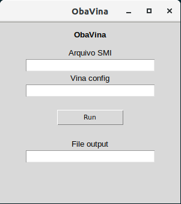

# ObaVina *(Beta)*

## Depois de obter os arquivos de configuração do Chimera o programa pode ser executado


## Pacotes necessarios para execução

```
sudo apt-get install python3-tk
```

## É necessario ter os seguintes programas instalados

* Babel
* Obabel
* Vina


## O programa apresenta um interface simples por esta em fase de testes


