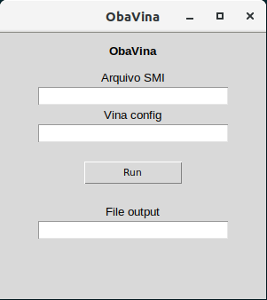

# ObaVina *(Beta)*

## Depois de obter os arquivos de configuração do Chimera o programa pode ser executado

## Pacotes necessarios para execução

* [Tkinter](https://docs.python.org/3/library/tkinter.html)
```
sudo apt-get install python3-tk
```

## É necessario ter os seguintes programas instalados

* [Obabel e Babel](http://openbabel.org/docs/dev/OpenBabel.pdf)
	* [Download](https://sourceforge.net/projects/openbabel/files/openbabel/2.3.1/openbabel-2.3.1.tar.gz/download)
* [Vina](http://vina.scripps.edu/)
	* [Download](http://vina.scripps.edu/download/autodock_vina_1_1_2_linux_x86.tgz)


## O programa apresenta um interface simples por esta em fase de testes


