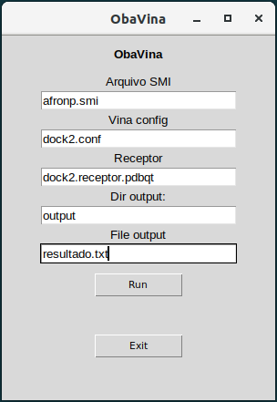

# ObaVina *(Beta)*

*O programa ainda esta sendo desenvolvido, por isso contamos com a colaboração do usuário*

## Importante
O programa até o momento para funcionar corretamente, deve esta no mesmo diretorio que os arquivos de chimera.


# Dependencias

## Pacotes necessarios para execução

* [Tkinter](https://docs.python.org/3/library/tkinter.html)
```
sudo apt-get install python3-tk
```

**É necessario ter os seguintes programas instalados (recomendamos a instalação via o apt)**

* [Obabel e Babel](http://openbabel.org)
	* [Download](https://sourceforge.net/projects/openbabel/files/openbabel/2.4.1/openbabel-2.4.1.tar.gz/download)

*Para instalar o openBabel execute:*

```
sudo apt install openbabel
```

ou

```
tar zxf openbabel-2.4.1.tar.gz
mkdir build
cd build
cmake ../openbabel-2.4.1
make
make -j4
make install
```

* [Vina](http://vina.scripps.edu/)
	* [Download](http://vina.scripps.edu/download/autodock_vina_1_1_2_linux_x86.tgz)

*Para instalar o vina execute:*

```
sudo apt install autodock-vina
```
ou

```
tar -xzvf autodock_vina_1_1_2_linux_x86.tgz
cd autodock_vina_1_1_2_linux_x86/bin
./vina
```

## Arquivos necessarios para execução:

**Depois de obter os arquivos de saida do Chimera o programa pode ser executado**
* afronp.smi
* dock2.conf
* dock2.receptor.pdbqt

# Execução

Para executar o programa abra o terminal e execute o script [graphic_obavina.py](graphic_obavina.py)
Exemplo:
```shell
user$ python graphic_obavina.py
```

Após informar todos os arquivos clique no botão run e aguarde o processamento, quando todos os dados forem
processados o botão _exit_ ficara disponivel.

## O programa apresenta um interface simples e pratica para a utilização



